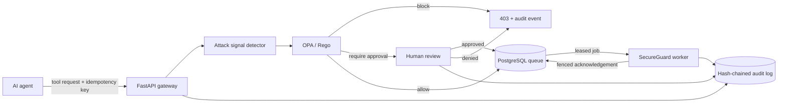

<div align="center">

# AgentGuard

**A policy-enforced security gateway for AI agent tool calls.**

FastAPI · Open Policy Agent / Rego · PostgreSQL · Python

[](#project-history)
[](https://www.python.org/)
[](https://www.openpolicyagent.org/)
[](LICENSE)

</div>

AgentGuard sits between an AI agent and its tools. Every requested action is inspected for
prompt injection and data-exfiltration signals, evaluated by an external Rego policy, and
then **allowed**, **blocked**, or held for **human approval**. Approved work reaches a
constrained SecureGuard worker through a crash-recoverable PostgreSQL queue.

## What this project demonstrates

- A FastAPI gateway using OPA/Rego to allow, block, or require human approval for agent
  tool calls.
- A crash-recoverable PostgreSQL job queue using expiring leases, fencing tokens,
  `FOR UPDATE SKIP LOCKED`, bounded retries, and idempotency to deliver work to SecureGuard.
- Prompt-injection and data-exfiltration attack tests, with agent actions and policy
  decisions written to an append-only, hash-chained audit log.

## Architecture



| Request | Example | Outcome |
|---|---|---|
| Allowlisted read | `search.query` | Queued immediately |
| Sensitive mutation | `email.send` | Waits for human approval |
| Prompt injection or exfiltration signal | Any tool | Blocked |
| Unknown tool | `python.eval` | Blocked by default |
| OPA unavailable or malformed response | Any tool | Blocked fail-closed |

## Quick start

Prerequisites: Docker with Compose and `curl`.

```bash
cp .env.example .env
docker compose up --build
```

The API is available at `http://localhost:8000`; interactive OpenAPI documentation is at
`http://localhost:8000/docs`.

In another terminal, run the three-outcome demo:

```bash
./scripts/demo.sh
```

Or submit an allowlisted call directly:

```bash
curl --fail-with-body -X POST http://localhost:8000/v1/tool-calls \
  -H 'Content-Type: application/json' \
  -H 'Idempotency-Key: read-demo-0001' \
  -d '{
    "agent_id": "research-assistant",
    "tool_name": "search.query",
    "arguments": {"query": "PostgreSQL lease queues"},
    "context": {"tenant": "demo"}
  }'
```

Reusing the same idempotency key and body returns the original request without enqueuing
another job. Reusing the key with a different body returns `409 Conflict`.

## Approval flow

Sensitive calls return `approval_required` and are not queued until reviewed:

```bash
curl --fail-with-body -X POST \
  http://localhost:8000/v1/tool-calls/REQUEST_ID/approval \
  -H 'Content-Type: application/json' \
  -d '{
    "approved": true,
    "reviewer": "security-on-call",
    "reason": "Recipient and content verified"
  }'
```

## Why the queue survives crashes

Workers do not remove jobs when they claim them. PostgreSQL marks a job `leased` with an
expiry and a unique lease token. If a worker dies, another worker can claim it after the
lease expires. Completion requires the current token, so a slow or restarted worker cannot
overwrite the recovered job's result. `SKIP LOCKED` lets multiple workers claim work without
double-processing the same row, while the request idempotency key prevents duplicate jobs at
the API boundary.

## Auditability

Policy decisions, human reviews, lease claims, retries, and completions are appended to
`audit_events`. Each event includes the previous event's SHA-256 digest in its own digest,
making later edits or deletion detectable. The database rejects `UPDATE` and `DELETE` on the
audit table.

```bash
curl 'http://localhost:8000/v1/audit/events?limit=25'
```

Arguments are intentionally excluded from policy-decision audit details to avoid copying
potential secrets into logs; only the tool name, decision, reason, policy ID, and normalized
risk categories are recorded.

## Tests

```bash
python -m venv .venv
source .venv/bin/activate
pip install -e '.[dev]'
pytest                         # unit tests; integration tests skip without a test database
ruff check .
ruff format --check .
docker compose run --rm opa test /policies -v
```

The CI workflow also provisions a disposable PostgreSQL service and runs integration tests
covering idempotent replay, conflicting keys, expired-lease recovery, and stale-worker
fencing.

## API surface

| Method | Route | Purpose |
|---|---|---|
| `POST` | `/v1/tool-calls` | Inspect, evaluate, and record a tool request |
| `POST` | `/v1/tool-calls/{id}/approval` | Approve or deny a held request |
| `GET` | `/v1/audit/events` | Read recent audit events |
| `GET` | `/health` | Process liveness |
| `GET` | `/ready` | PostgreSQL readiness |

See [the threat model](docs/THREAT_MODEL.md) for trust boundaries and residual risks.

## Production hardening

This is a portfolio-grade reference implementation, not a drop-in production control
plane. Before production use, add gateway authentication and tenant authorization, TLS,
database roles with least privilege, secret-backed configuration, policy bundle signing,
rate limiting, observability, and real tool adapters isolated by network and OS sandboxes.

## Project history

AgentGuard was started in **July 2026** and is under active development.

## License

[MIT](LICENSE)

